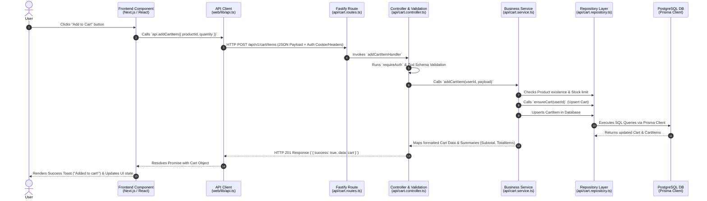

# End-to-End Code Flow Explanation: "Add to Cart"

This document explains the full end-to-end request flow for a core feature in the application—**Adding an Item to the Cart**—tracing its execution from the **Frontend UI**, through the **API Layer**, **Controller**, **Service**, **Repository**, down to the **Database (DB)** and back.

---

## 🏗 System Architecture Flow Overview



---

## 🔍 Step-by-Step Breakdown with Source Code

### 1. Frontend UI Component (User Action)
- **File**: [`apps/web/app/(store)/products/[slug]/page.tsx`](file:///c:/Users/abdul/OneDrive/%D8%B3%D8%B7%D8%AD%20%D8%A7%D9%84%D9%85%D9%83%D8%AA%D8%A8/hejazi/apps/web/app/%28store%29/products/%5Bslug%5D/page.tsx#L47-L55)

**How it works**:
When the user clicks the "Add to Cart" button on the product details page, the `addToCart` handler is invoked. It extracts the `product.id` and the user-selected `quantity`, then calls the API utility helper.

```typescript
const addToCart = async () => {
  if (!product) return;
  try {
    // Calls the frontend API wrapper
    await api.addCartItem({ productId: product.id, quantity });
    toast.success(`Added ${quantity} x "${product.name}" to cart!`);
  } catch (e: any) {
    toast.error(e.message || 'Failed to add item to cart');
  }
};
```

---

### 2. Frontend HTTP API Client (Network Request)
- **File**: [`apps/web/lib/api.ts`](file:///c:/Users/abdul/OneDrive/%D8%B3%D8%B7%D8%AD%20%D8%A7%D9%84%D9%85%D9%83%D8%AA%D8%A8/hejazi/apps/web/lib/api.ts#L32-L45) & [`lines 121-125`](file:///c:/Users/abdul/OneDrive/%D8%B3%D8%B7%D8%AD%20%D8%A7%D9%84%D9%85%D9%83%D8%AA%D8%A8/hejazi/apps/web/lib/api.ts#L121-L125)

**How it works**:
`api.addCartItem` delegates the network request to the generic `request` wrapper function. It formats the request body as JSON, sets `Content-Type: application/json` and `credentials: 'include'`, sending an HTTP `POST` request to `http://localhost:4000/api/v1/cart/items`.

```typescript
// Specific helper definition:
addCartItem: (payload: { productId: string; quantity: number }) =>
  request<Cart>('/cart/items', {
    method: 'POST',
    body: JSON.stringify(payload),
  }),

// Generic request wrapper:
const request = async <T>(path: string, init?: RequestInit): Promise<T> => {
  const headers = new Headers(init?.headers ?? undefined);
  if (init?.body !== undefined && !headers.has('Content-Type')) {
    headers.set('Content-Type', 'application/json');
  }

  const response = await fetch(`${API_BASE}${path}`, {
    ...init,
    credentials: 'include',
    headers,
  });

  const body = await response.json();
  if (!response.ok) {
    throw new HttpError(body.error?.message || 'API Request failed', response.status);
  }
  return body.data as T;
};
```

---

### 3. Backend Route Registration (Fastify)
- **File**: [`apps/api/src/modules/cart/cart.routes.ts`](file:///c:/Users/abdul/OneDrive/%D8%B3%D8%B7%D8%AD%20%D8%A7%D9%84%D9%85%D9%83%D8%AA%D8%A8/hejazi/apps/api/src/modules/cart/cart.routes.ts#L11)

**How it works**:
The Fastify router matches the incoming HTTP request path `/cart/items` with method `POST` and dispatches execution to `addCartItemHandler`.

```typescript
export const cartRoutes = async (app: FastifyInstance) => {
  app.get('/', getMyCartHandler);
  app.post('/items', addCartItemHandler); // <--- Handles POST /cart/items
  app.put('/items/:id', updateCartItemHandler);
  app.delete('/items/:id', deleteCartItemHandler);
};
```

---

### 4. Backend Controller & Validation
- **Files**:
  - [`apps/api/src/modules/cart/cart.controller.ts`](file:///c:/Users/abdul/OneDrive/%D8%B3%D8%B7%D8%AD%20%D8%A7%D9%84%D9%85%D9%83%D8%AA%D8%A8/hejazi/apps/api/src/modules/cart/cart.controller.ts#L13-L18)
  - [`apps/api/src/modules/cart/cart.schemas.ts`](file:///c:/Users/abdul/OneDrive/%D8%B3%D8%B7%D8%AD%20%D8%A7%D9%84%D9%85%D9%83%D8%AA%D8%A8/hejazi/apps/api/src/modules/cart/cart.schemas.ts#L3-L6)

**How it works**:
1. **Authentication Check**: `requireAuth(request, reply)` verifies session credentials and attaches `request.auth.userId`.
2. **Input Validation**: Zod schema `addCartItemSchema.parse(...)` verifies `productId` is a non-empty string and `quantity` is a positive integer between 1 and 100.
3. **Service Call**: Delegates execution to the business service layer.

```typescript
// Validation Schema (cart.schemas.ts)
export const addCartItemSchema = z.object({
  productId: z.string().min(1),
  quantity: z.coerce.number().int().positive().max(100),
});

// Controller Handler (cart.controller.ts)
export const addCartItemHandler = async (request: FastifyRequest, reply: FastifyReply) => {
  await requireAuth(request, reply);
  const payload = addCartItemSchema.parse(request.body);
  const cart = await addCartItem(request.auth!.userId, payload);
  return ok(reply, cart, 201);
};
```

---

### 5. Backend Service Layer (Business Logic)
- **File**: [`apps/api/src/modules/cart/cart.service.ts`](file:///c:/Users/abdul/OneDrive/%D8%B3%D8%B7%D8%AD%20%D8%A7%D9%84%D9%85%D9%83%D8%AA%D8%A8/hejazi/apps/api/src/modules/cart/cart.service.ts#L54-L96)

**How it works**:
This layer contains all business rules and orchestration:
1. **Product Verification**: Ensures the product exists and `isActive === true`.
2. **Stock Check**: Validates requested quantity against available `stockQuantity`.
3. **Cart Initialization**: Calls `ensureCart(userId)` to create a cart record if one doesn't exist yet.
4. **Upsert Item**: Checks if the item already exists in the cart. If present, it increments the quantity; otherwise, it creates a new `CartItem`.
5. **Data Formatting**: Fetches and returns a calculated representation of the cart (line totals, subtotal, total item count).

```typescript
export const addCartItem = async (userId: string, payload: { productId: string; quantity: number }) => {
  // 1. Verify product availability
  const product = await prisma.product.findUnique({ where: { id: payload.productId } });
  if (!product || !product.isActive) {
    throw new AppError('Product unavailable', 404, 'PRODUCT_UNAVAILABLE');
  }

  // 2. Validate stock capacity
  if (payload.quantity > product.stockQuantity) {
    throw new AppError('Quantity exceeds stock', 400, 'INSUFFICIENT_STOCK');
  }

  // 3. Ensure user has an active cart entity
  const cart = await ensureCart(userId);

  // 4. Check for existing item in cart
  const existing = await prisma.cartItem.findUnique({
    where: { cartId_productId: { cartId: cart.id, productId: payload.productId } },
  });

  if (existing) {
    const nextQty = existing.quantity + payload.quantity;
    if (nextQty > product.stockQuantity) {
      throw new AppError('Quantity exceeds stock', 400, 'INSUFFICIENT_STOCK');
    }
    await prisma.cartItem.update({
      where: { id: existing.id },
      data: { quantity: nextQty },
    });
  } else {
    await prisma.cartItem.create({
      data: { cartId: cart.id, productId: payload.productId, quantity: payload.quantity },
    });
  }

  // 5. Return updated cart object
  return fetchMyCart(userId);
};
```

---

### 6. Backend Data Access / Repository Layer
- **File**: [`apps/api/src/modules/cart/cart.repository.ts`](file:///c:/Users/abdul/OneDrive/%D8%B3%D8%B7%D8%AD%20%D8%A7%D9%84%D9%85%D9%83%D8%AA%D8%A8/hejazi/apps/api/src/modules/cart/cart.repository.ts#L3-L24)

**How it works**:
Encapsulates direct database queries using the Prisma Client ORM.

```typescript
// Fetch Cart with nested CartItems and Product details
export const getCartByUserId = (userId: string) =>
  prisma.cart.findUnique({
    where: { userId },
    include: {
      items: {
        include: { product: { include: { category: true } } },
        orderBy: { createdAt: 'desc' },
      },
    },
  });

// Upsert (find or create) Cart for user
export const ensureCart = async (userId: string) => {
  return prisma.cart.upsert({
    where: { userId },
    update: {},
    create: { userId },
  });
};
```


### 7. Database Layer (Prisma & PostgreSQL)
- **File**: [`apps/api/prisma/schema.prisma`](file:///c:/Users/abdul/OneDrive/%D8%B3%D8%B7%D8%AD%20%D8%A7%D9%84%D9%85%D9%83%D8%AA%D8%A8/hejazi/apps/api/prisma/schema.prisma#L152-L175)

**How it works**:
Defines the relational tables in PostgreSQL database. A `Cart` belongs to one `User`, and contains zero or more `CartItem` rows. A unique composite index `@@unique([cartId, productId])` guarantees that a single product cannot be duplicated as separate rows inside the same cart.

```prisma
model Cart {
  id        String     @id @default(cuid())
  userId    String     @unique
  createdAt DateTime   @default(now())
  updatedAt DateTime   @updatedAt

  user  User       @relation(fields: [userId], references: [id], onDelete: Cascade)
  items CartItem[]
}

model CartItem {
  id        String   @id @default(cuid())
  cartId    String
  productId String
  quantity  Int
  createdAt DateTime @default(now())
  updatedAt DateTime @updatedAt

  cart    Cart    @relation(fields: [cartId], references: [id], onDelete: Cascade)
  product Product @relation(fields: [productId], references: [id], onDelete: Restrict)

  @@unique([cartId, productId])
  @@index([cartId])
  @@index([productId])
}
```

---

## 🔄 Return Journey (Response Back to UI)

1. **DB to Service**: PostgreSQL updates records; Prisma returns updated models.
2. **Service Mapping**: `mapCart()` calculates `subtotal`, line totals (`unitPrice * quantity`), and formats the response standard shape.
3. **Controller Response**: `ok(reply, cart, 201)` serializes the payload into a standard JSON envelope:
   ```json
   {
     "success": true,
     "data": {
       "id": "clx...",
       "items": [...],
       "summary": { "subtotal": 150.00, "totalItems": 3 }
     }
   }
   ```
4. **Client UI Update**: Promise in `page.tsx` resolves, triggering `toast.success(...)` to inform the user.
