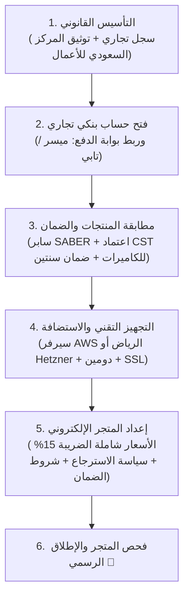

# 🇸🇦 الدليل الشامل للمتطلبات النظامية وتكاليف إطلاق المتجر الإلكتروني في السعودية
### (قطاع كاميرات المراقبة، الأجهزة الكهربائية، وأنظمة الطاقة والإلكترونيات)

---

## 📌 نظرة عامة
يوضح هذا الدليل كافة الاشتراطات والمتطلبات القانونية والتنظيمية لتأسيس وإطلاق شركة ومتجر إلكتروني في المملكة العربية السعودية لبيع **كاميرات المراقبة، الأجهزة الكهربائية، الإلكترونيات، وأنظمة الطاقة والبطاريات**، بالإضافة إلى خيارات وتكاليف استضافة الخوادم (Hosting) والخدمات السحابية.

---

## 🏢 1. المتطلبات القانونية وتراخيص الشركة (وزارة التجارة والمركز السعودي للأعمال)

لتشغيل متجر إلكتروني تجاري نظامي في المملكة، يجب استيفاء ما يلي:

### أ. السجل التجاري (Commercial Registration - CR)
* استخراج سجل تجاري إلكتروني يتضمن الأنشطة المحددة وفق التصنيف الوطني للأنشطة الاقتصادية (ISIC 4):
  * **تجارة التجزئة عن طريق الإنترنت (تجارة إلكترونية)**.
  * **تجارة التجزئة في الأجهزة الكهربائية والإلكترونية**.
  * **تجارة أجهزة وكاميرات المراقبة والأنظمة الأمنية وملحقاتها بالتجزئة**.
  * **تجارة معدات وتجهيزات الطاقة المتجددة/الشمسية والبطاريات بالتجزئة**.

### ب. التوثيق في المركز السعودي للأعمال (SBC)
* ربط السجل التجاري والمتجر الإلكتروني والحصول على **رمز التوثيق (QR Code)** الخاص بالمركز السعودي للأعمال كمتجر معتمد وموثوق.

### ج. المتطلبات الإلزامية في واجهة وتذييل المتجر (Storefront & Footer)
يلزم نظام التجارة الإلكترونية السعودي عرض البيانات التالية بشكل واضح في الموقع:
1. **الاسم التجاري ورقم السجل التجاري (CR Number)**.
2. **الرقم الضريبي للقيمة المضافة (VAT Number)** من هيئة الزكاة والضريبة والجمارك.
3. **شعار/رمز التوثيق من المركز السعودي للأعمال (SBC Badge)**.
4. **وسائل التواصل الرسمية**: بريد الدعم الإلكتروني، رقم الهاتف المعتمد، والعنوان الفعلي للمؤسسة/الشركة.
5. **سياسة الاستبدال والاسترجاع والضمان** المعتمدة والمتوافقة مع أنظمة وزارة التجارة.
6. **سياسة الخصوصية والشروط والأحكام**.

---

## ⚡ 2. الاشتراطات الفنية والهيئات الرقابية (كاميرات، أجهزة كهربائية، طاقة)

تخضع هذه المنتجات لهيئات تنظيمية تختلف عن مستحضرات التجميل، وتتطلب الالتزام بالمعايير التالية:

### أ. الهيئة السعودية للمواصفات والمقاييس والجودة (SASO) ومنصة سابر (SABER)
1. **التسجيل في منصة سابر (SABER)**:
   * تسجيل كافة المنتجات الكهربائية، الكاميرات، الشواحن، وأنظمة الطاقة للحصول على شهادة المطابقة للمنتج (**PCoC**) وشهادة مطابقة الإرسالية (**SCoC**) عند الاستيراد.
2. **شهادة الاعتراف بمطابقة الأجهزة الكهربائية (SASO IECEE)**:
   * إلزامية للأجهزة الكهربائية والإلكترونية، مزودات الطاقة، الشواحن، وبطاريات الليثيوم لضمان السلامة والحماية من الحريق أو التلف.
3. **بطاقة كفاءة الطاقة (ترشيد - SL&TE)**:
   * للمنتجات المشمولة في اللائحة الفنية لكفاءة الطاقة (مثل الأجهزة الكهربائية المحددة ومعدات الإضاءة والطاقة).
4. **المواصفات القياسية للكهرباء**:
   * الجهد الكهربائي القياسي بالمملكة: **230/400 فولت (أو 220 فولت) بتردد 60 هرتز**.
   * القابس الكهربائي المعتمد: **الفيش الثلاثي (Type G - البريطاني)** المطابق للمواصفة القياسية السعودية.

---

### ب. هيئة الاتصالات والفضاء والتقنية (CST)
* **اعتماد النوعية (Type Approval)**:
  * إلزامي لجميع كاميرات المراقبة، الأجهزة الذكية، وأجهزة التحكم في الطاقة التي تحتوي على تقنيات اتصال لاسلكي مثل: **Wi-Fi, Bluetooth, 4G/5G SIM cards, Zigbee, IoT**.
  * يجب التأكد من مطابقة أجهزة البث اللاسلكي للترددات المسموح بها داخل المملكة.

---

### ج. تنظيمات بيع كاميرات المراقبة الأمنية (نظام استخدام كاميرات المراقبة الأمنية)
* **الامتثال للائحة التنفيذية لنظام كاميرات المراقبة الصادر بالمرسوم الملكي**:
  * الالتزام بالمواصفات الفنية المعتمدة من الجهات المختصة لكاميرات المراقبة (الدقة، الرؤية الليلية، التخزين).
  * إضافة إشعار وإخلاء مسؤولية في المتجر وسياسة الخصوصية يوضح أن استخدام الكاميرات يجب أن يكون وفق الأنظمة والقوانين المعمول بها في المملكة (يُمنع استخدامها لانتهاك الخصوصية أو التجسس وفق نظام مكافحة جرائم المعلوماتية).

---

### د. تنظيمات أنظمة الطاقة، البطاريات، والألواح الشمسية
* التأكد من مطابقة أنظمة الطاقة الشمسية ومحولات التيار (Inverters) والبطاريات (Lithium/Gel) لكود البناء السعودي والمواصفات الفنية لحماية المنشآت والشبكات الكهربائية.
* عرض بيانات الأمان وإرشادات التركيب والتحذيرات بوضوح في صفحات المنتجات.

---

## 🛡️ 3. الضمان وحماية المستهلك (وزارة التجارة)

وفقاً لدليل حقوق المستهلك الصادر عن وزارة التجارة للأجهزة الكهربائية والإلكترونية:
1. **الضمان الإلزامي سنتين (24 شهراً)**:
   * تلتزم الشركة بتقديم ضمان لا يقل عن **سنتين** على جميع الأجهزة الكهربائية والإلكترونية ضد العيوب المصنعية.
2. **توفير قطع الغيار والصيانة**:
   * الالتزام بتوفير قطع الغيار ومراكز الخدمة والصيانة أو استبدال المنتج المعيب وفق الفترات الزمنية المحددة نظاماً.
3. **عرض بيانات المنتج بوضوح في المتجر**:
   * المواصفات الفنية الكاملة (الجهد، الاستطاعة، الدقة، بلد المنشأ، الموديل، مدة الضمان وشروطه).

---

## 🧾 4. المتطلبات المالية والضريبية (ZATCA & Payment Gateways)

### أ. هيئة الزكاة والضريبة والجمارك (ZATCA)
1. **ضريبة القيمة المضافة (15% VAT)**:
   * التسجيل في الضريبة وعرض الأسعار شاملة الضريبة، مع توضيح مبلغ الضريبة المنفصل في سلة الشراء وصفحة الدفع.
2. **الفاتورة الضريبية الإلكترونية المبسطة**:
   * إصدار فاتورة إلكترونية بعد كل عملية شراء تحتوي على: رقم الفاتورة، تاريخها، الرقم الضريبي للمتجر، تفاصيل المنتجات، قيمة الضريبة (15%)، وتجهيز النظام لمتطلبات الربط والتكامل (Phase 2).

### ب. بوابات الدفع الإلكتروني (Payment Gateways)
* التعاقد مع بوابة دفع مرخصة من البنك المركزي السعودي (SAMA) مثل: **Moyasar**, **Tap Payments**, **PayTabs**, أو **HyperPay**.
* دعم طرق الدفع المفضلة في السوق السعودي:
  * 💳 **مدى (Mada)** - أساسي وأعلى نسبة استخدام.
  * 🍏 **Apple Pay** - أساسي لمستخدمي الهواتف الذكية.
  * 💳 **البطاقات الائتمانية (Visa / MasterCard)**.
  * ⏱️ **خدمات الدفع الآجل والتقسيط (Tabby & Tamara)**:
    > [!TIP]
    > خدمات الدفع الآجل (تابي/تمارا) مهمة جداً لمتجر يبيع الكاميرات وأنظمة الطاقة والأجهزة الكهربائية بسبب ارتفاع متوسط قيمة السلة الشرائية (AOV).

---

## 🔒 5. نظام حماية البيانات الشخصية (SDAIA / PDPL) this is done 

تطبيقاً لنظام حماية البيانات الشخصية الصادر عن الهيئة السعودية للبيانات والذكاء الاصطناعي (سدايا):
1. **سياسة الخصوصية والموافقة الصريحة**:
   * أخذ موافقة واضحة من المستخدم عند التسجيل، وتوضيح كيفية حفظ واستخدام بياناته الشخصية (الاسم، العنوان، رقم الجوال).
2. **حقوق المستخدم**:
   * إتاحة خيار للمستخدم للاطلاع على بياناته، تعديلها، أو طلب حذف حسابه.
3. **أمان البيانات والتشفير**:
   * تشفير كامل لبيانات العملاء والاتصالات عبر بروتوكولات **HTTPS / SSL (TLS 1.3)** وتأمين قواعد البيانات.
   * يُسمح نظاماً باستضافة بيانات التجارة الإلكترونية التجارية على سيرفرات سحابية خارجية معتمدة شريطة استيفاء ضوابط التشفير والأمان.

---

## 💰 6. مقارنة خيارات وتكاليف استضافة الخوادم (Server Hosting) this is done

| الخيار ونوع الاستضافة | المزود والمنطقة | المواصفات الفنية المقترحة | التكلفة الشهرية (بالدولار) | التكلفة الشهرية (بالريال السعودي) | سرعة الاستجابة (Latency للسعودية) |
| :--- | :--- | :--- | :---: | :---: | :---: |
| **الخيار (1): سيرفر سحابي دولي VPS** *(الموصى به للبدء)* | **Hetzner Cloud** (فرانكفورت/ألمانيا) | 2 vCPU, 4 GB RAM, 40 GB NVMe | **~$6.00 / شهر** | **~22.50 ريال** | ~75 - 85 ms |
| **الخيار (2): سيرفر سحابي دولي VPS** | **DigitalOcean / Linode** (أوروبا) | 2 vCPU, 4 GB RAM, 80 GB SSD | **~$12.00 / شهر** | **~45.00 ريال** | ~80 - 90 ms |
| **الخيار (3): سيرفر سحابي محلي بالسعودية** | **AWS Riyadh** (`me-central-1`) | 2 vCPU, 4 GB RAM (Lightsail/EC2) | **~$30.00 / شهر** | **~112.50 ريال** | **~10 - 15 ms (فائق السرعة)** |
| **الخيار (4): سيرفر سحابي محلي بالسعودية** | **Google Cloud Dammam** (`me-central2`) | e2-standard-2 (2 vCPU, 4 GB) | **~$32.00 / شهر** | **~120.00 ريال** | **~10 - 15 ms (فائق السرعة)** |

---

## 🌐 7. الخدمات الإضافية والتكاليف التشغيلية التقنية this is done

1. **النطاق (Domain Name)**:
   * نطاق سعودي رسمي (`.sa` أو `.com.sa` عبر المركز السعودي لمعلومات الشبكة / المسجلين المعتمدين): حوالي **50 - 100 ريال سنوياً**.
   * نطاق دولي (`.com` عبر Cloudflare أو Namecheap): حوالي **45 - 60 ريال سنوياً**.
2. **البريد الإلكتروني للعمل وإشعارات الطلبات**:
   * **AWS SES (Amazon Simple Email Service)**: تكلفة شبه مجانية (أول 62,000 إيميل شهرياً مجاناً ثم $0.10 لكل 1,000 إيميل).
   * **Google Workspace / Zoho Mail**: للإيميلات الرسمية للإدارة وفريق العمل (حوالي 15 - 25 ريال شهرياً لكل مستخدم).
3. **شهادة الأمان والحماية (SSL & CDN)**:
   * **Cloudflare (الخطة المجانية)**: حماية من هجمات DDoS، تسريع التصفح في الخليج عبر شبكة CDN، وشهادة SSL مجانية.
4. **بوابات الدفع (رسوم العمليات)**:
   * **مدى (Mada)**: 1% + 1 ريال لكل عملية (بحد أقصى ميسر).
   * **Visa / Mastercard**: 2.5% إلى 2.75% + 1 ريال.
   * **تابي / تمارا**: نسبة تتراوح بين 5% إلى 7% + رسوم ثابتة.

---

## 📋 8. خطة العمل وخريطة الإطلاق (Launch Action Checklist)

### الخطوات التنفيذية بالتفصيل:
1. [ ] **السجل التجاري**: التأكد من وجود أنشطة (التجارة الإلكترونية، الأجهزة الكهربائية، كاميرات المراقبة، وأنظمة الطاقة).
2. [ ] **المركز السعودي للأعمال**: توثيق المتجر والحصول على البادج ورمز QR.
3. [ ] **الحساب البنكي وبوابات الدفع**: فتح حساب بنكي للشركة وربط بوابة دفع (Moyasar أو Tap) + خدمة تقسيط (Tabby/Tamara).
4. [ ] **التوافق التنظيمي**:
   * تسجيل المنتجات في **منصة سابر (SABER)** والحصول على شهادات المطابقة.
   * التأكد من شهادات **اعتماد النوعية (CST)** لكاميرات المراقبة والراوترات والأجهزة اللاسلكية.
   * تجهيز وثائق الضمان (ضمان سنتين إلزامي للأجهزة الكهربائية).
5. [ ] **إعدادات المتجر في الموقع**:
   * إضافة أرقام السجل التجاري والرقم الضريبي ورابط التوثيق في أسفل الموقع (Footer).
   * ضبط حساب ضريبة القيمة المضافة 15% في فواتير المتجر والسلة.
   * كتابة وتفعيل سياسة الضمان والاسترجاع والاستبدال الواضحة.
6. [ ] **الاستضافة والبنية التحتية**:
   * نشر الموقع على السيرفر وربط النطاق وتفعيل شهادة SSL السحابية وخدمة البريد AWS SES.
